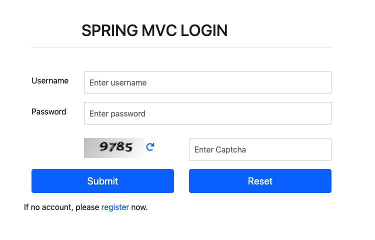
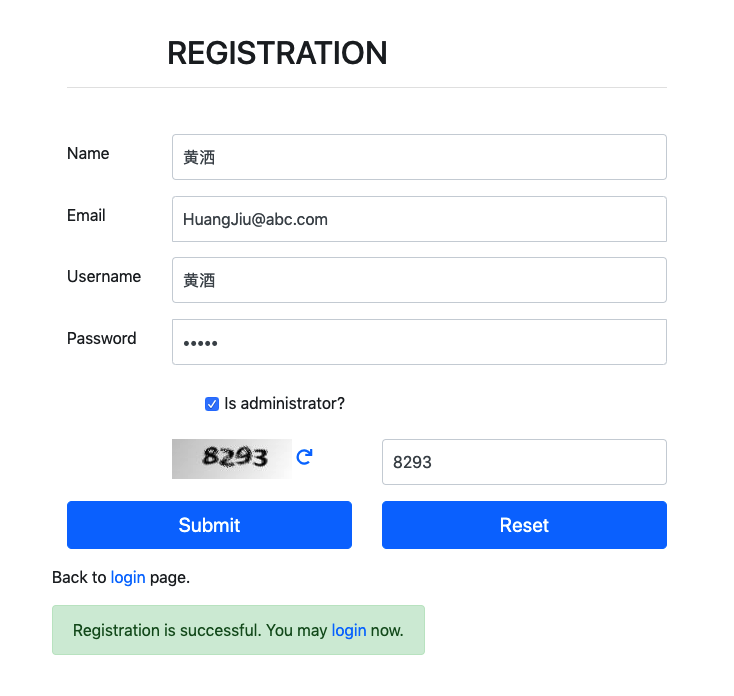
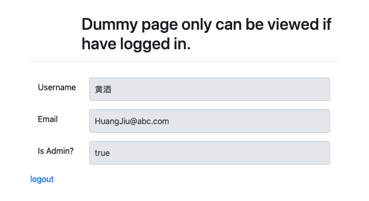
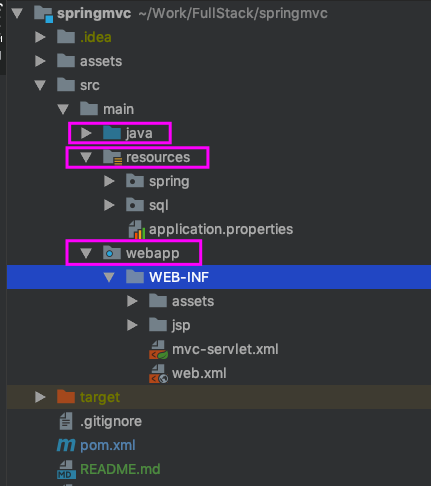
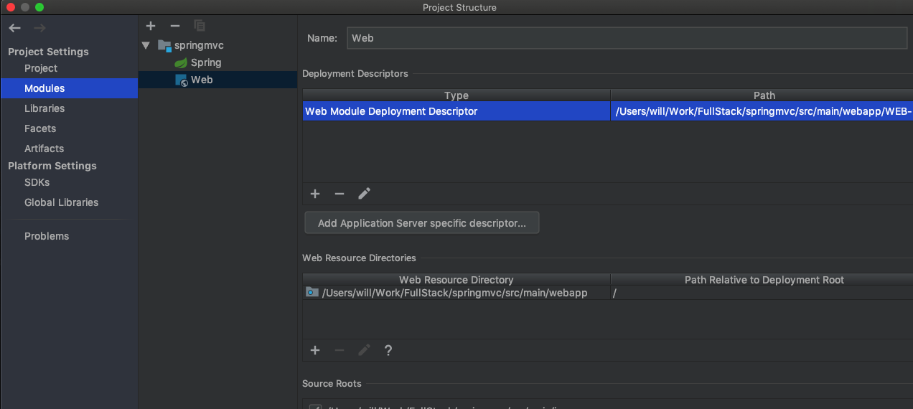
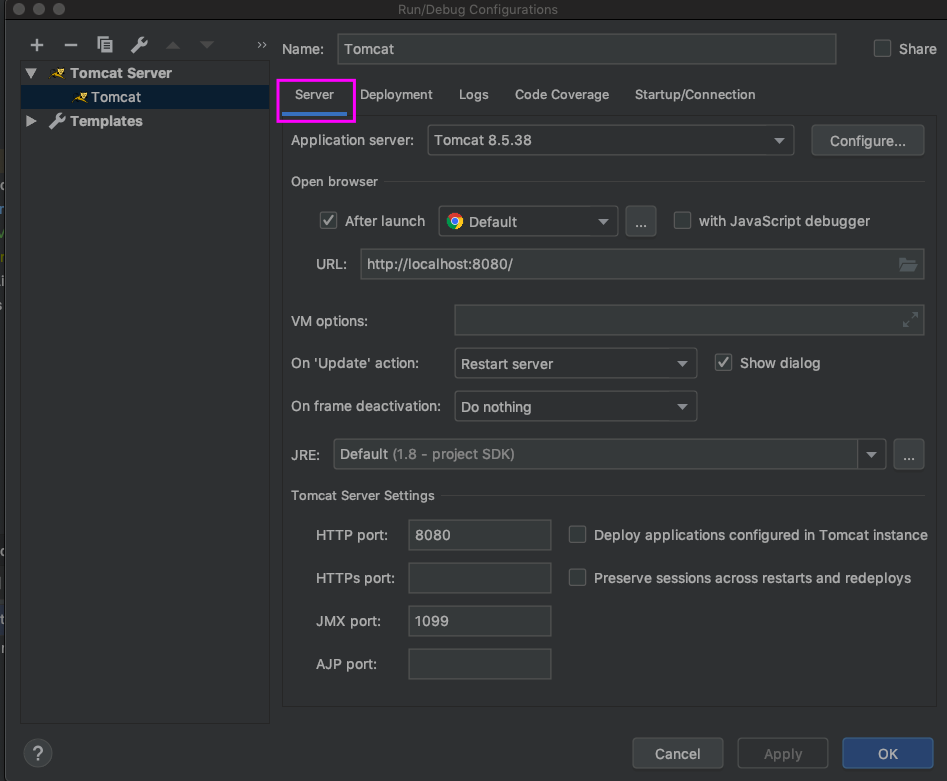
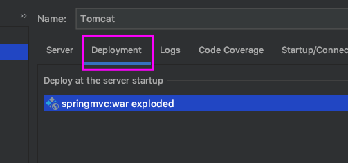

## Description

MVC login page with Capture

## Screenshot

1 . Login page

2 . Registration page

3 . After login

## How to run in intellij?

1 . Folder structure

2 . Project settings

3 . Embed tomcat

